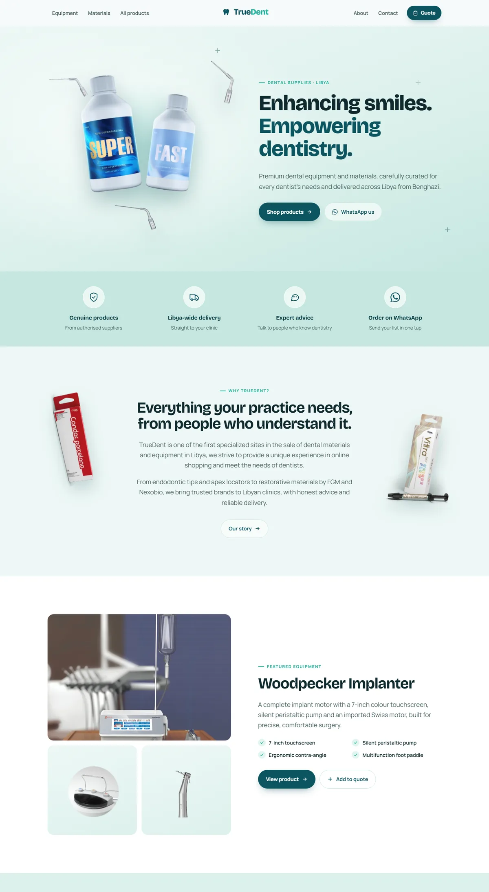
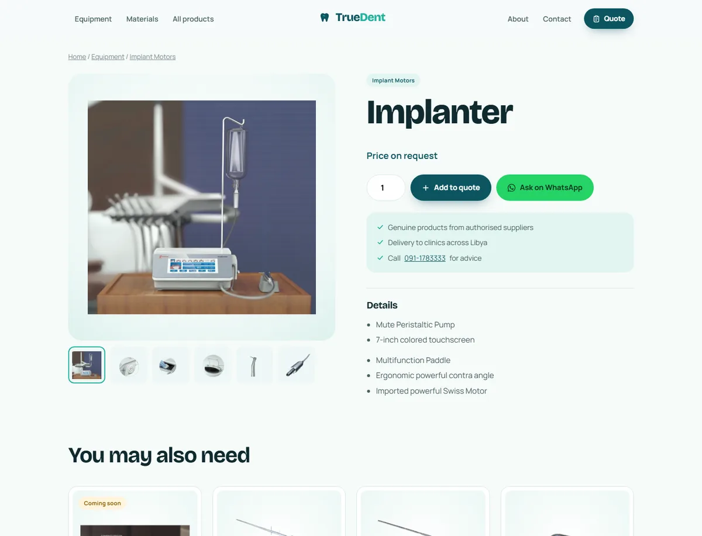

# TrueDent

Website for **TrueDent**, a dental materials and equipment supplier in Benghazi, Libya.

**Live demo: [nehalnee.github.io/truedent](https://nehalnee.github.io/truedent/)**



<details>
<summary>Product page</summary>



</details>

This is a rebuild of the original WordPress/WooCommerce site (truedent.ly, backed up July 2023) as a fast
static site with [Astro](https://astro.build). The products, photos, categories and page text were recovered
from that backup.

## What's in it

- **58 products** across Dental Equipment (26) and Dental Materials (32), with photos and spec images
- Filterable listings by equipment type or material brand (Nexobio, FGM, RAMO, Prevest DenePro)
- A product page for each item, with gallery, details and related products
- **Quote list**: visitors add products and quantities, then send the whole list to the store on WhatsApp
- About, Contact and 404 pages, SEO metadata and product structured data
- No database, no server and no WordPress to maintain

## Run it locally

Requires Node.js 22+.

```bash
npm install
npm run dev        # http://localhost:4321
npm run build      # static site in dist/
npm run preview    # preview the built site
```

## Editing content

| What | Where |
|---|---|
| Products (names, descriptions, categories, images) | `src/data/products.json` |
| Phone numbers, WhatsApp, email, city | `src/data/site.json` |
| Category names and group descriptions | `src/lib/catalog.ts` |
| Product images | `public/images/products/` |

**Prices:** every product shows "Price on request". The old site only had placeholder prices
(most products were 32 LYD). To show a real price, set `"price"` on that product in `products.json`
(e.g. `"price": 450`). The old value is kept in `originalWpPrice` for reference only.

**New images:** drop PNG/JPG files into `public/images/...`, then run `npm run optimize-images`.
It converts them to compact WebP and updates the references in `products.json`.

## Deploying

The build output in `dist/` is plain HTML/CSS/JS, so it can be hosted anywhere: Netlify, Vercel,
Cloudflare Pages, GitHub Pages, or any web server. Point the `truedent.ly` domain at it.

The demo is deployed to GitHub Pages automatically on every push to `main`
(see `.github/workflows/deploy.yml`). Because Pages serves it from a sub-folder, that build sets
`BASE_PATH=/truedent`; on a real domain leave it unset. Use the `u()` helper from `src/lib/url.ts`
for any new internal link or image path so it works in both places.
